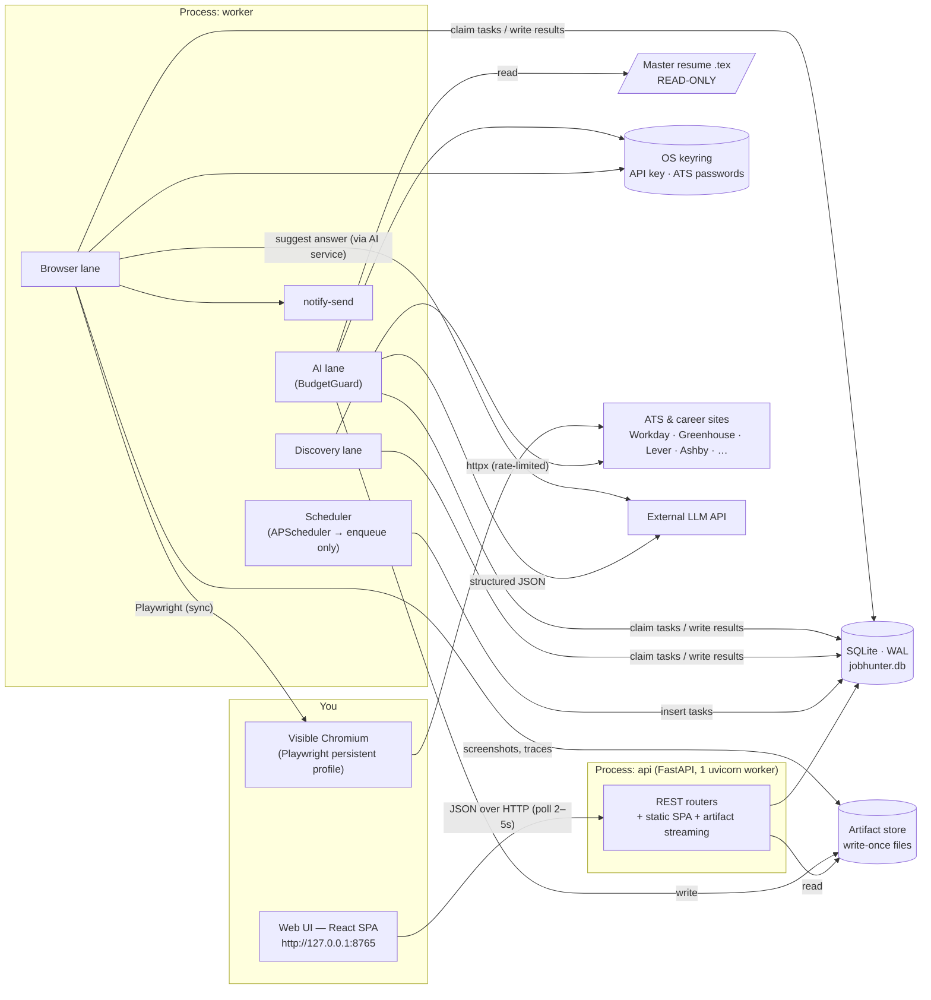
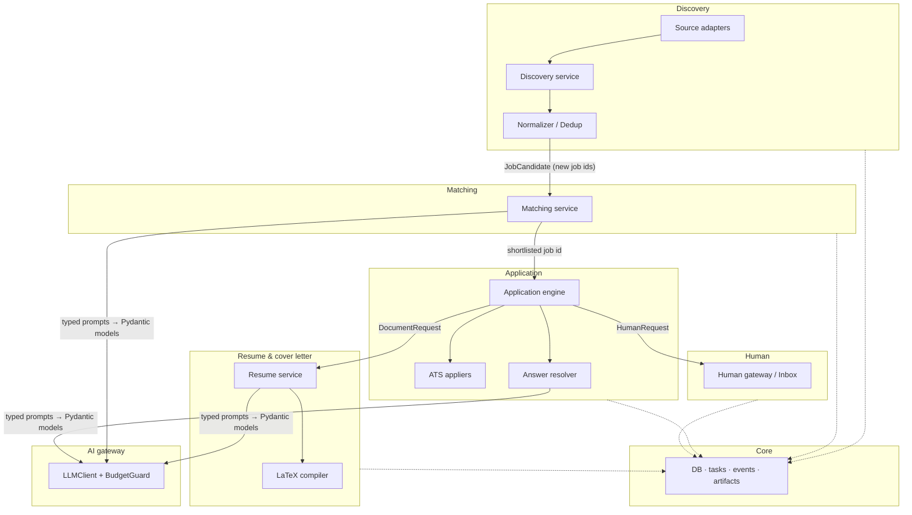
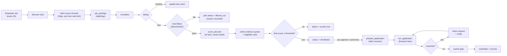
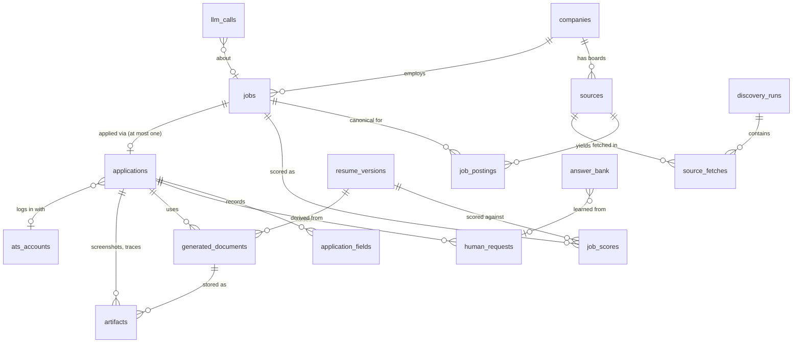
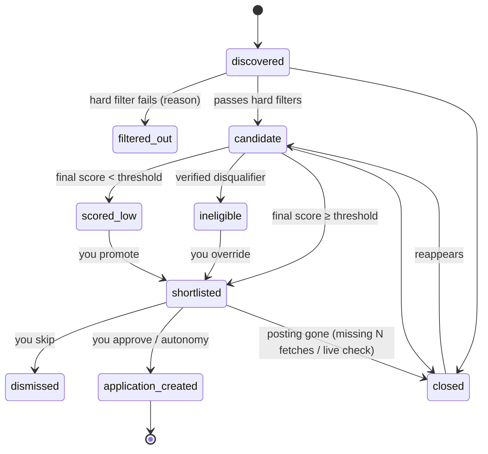
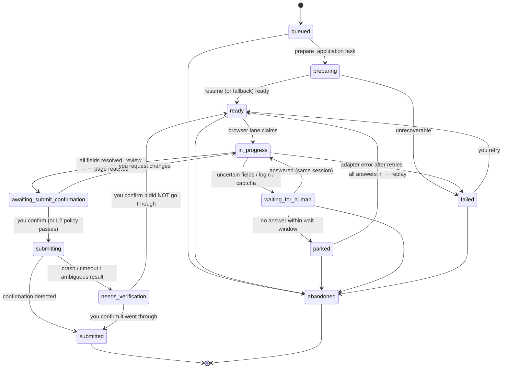
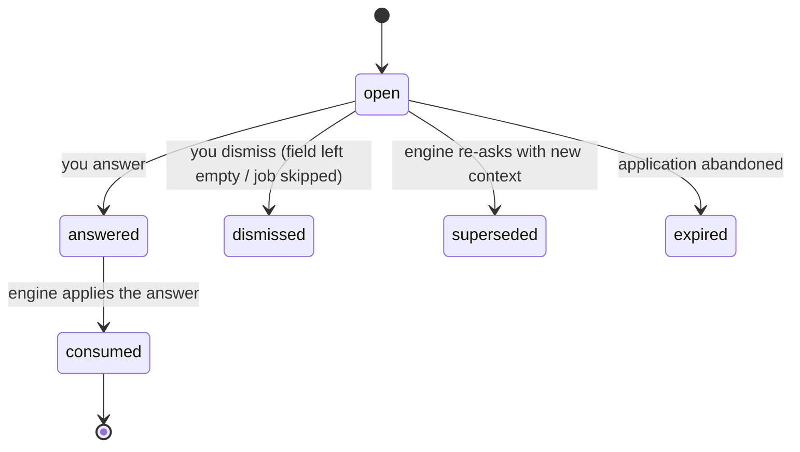
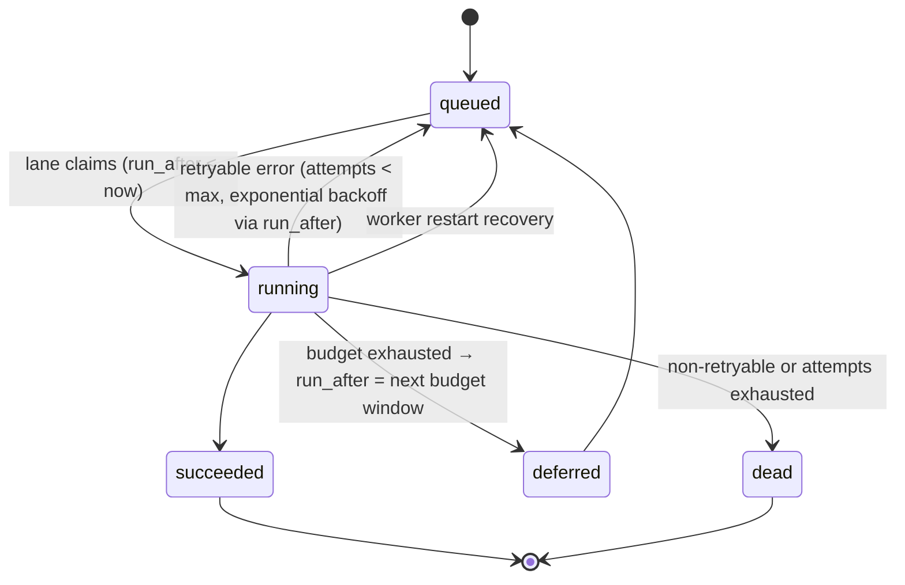

# Architecture Overview — Local Job Hunting Assistant

Status: proposed · Scope: target-state architecture before any code is written.

The ten things you asked for map to these sections:

| # | Ask | Section |
|---|-----|---------|
| 1–2 | Components and responsibilities | [Component Responsibilities](#component-responsibilities) |
| 3 | Data flow | [Data Flow](#data-flow) |
| 4 | Database entities | [Data Architecture](#data-architecture) |
| 5 | Important interfaces | [API Architecture and Internal Interfaces](#api-architecture-and-internal-interfaces) |
| 6 | Directory structure | [Directory Structure](#directory-structure) |
| 7 | State machines | [State Machines](#state-machines) |
| 8 | Testing strategy | [Testing Strategy](#testing-strategy) |
| 9 | Subsystem boundaries | [Subsystem Boundaries](#subsystem-boundaries) |
| 10 | Deterministic vs AI | [Deterministic vs AI-Powered](#deterministic-vs-ai-powered) |

---

## Problem Understanding

A single-user, local-only Linux application that continuously finds US software/CS internships, ranks them against a master resume (generously), prepares a tailored resume copy per application, and drives a **visible** Chromium browser through application forms. Deterministic fields are filled automatically, and it **stops and asks** whenever something is uncertain or consequential. Nothing leaves the machine except calls to the ATS/career sites and to one external LLM API, and LLM spend stays around $1–2/day.

The design goal is a boring, robust local tool rather than a cloud product. The hardest problems here are not scale. They are:

1. **Correctness under autonomy**: never apply twice, never submit guessed consequential answers, never touch the master resume.
2. **Resumability**: a long-running process that waits on a human for hours, crashes, reboots, or sleeps must pick up exactly where it left off.
3. **Source brittleness**: ATS sites change and resist automation, so each one must be isolated behind an adapter.
4. **Cost discipline**: AI is used only where judgment is needed, behind a hard budget.

### Assumptions

| Id | Assumption (conservative value) | Reasoning | Drives |
|----|--------------------------------|-----------|--------|
| A1 | Runs on your personal Linux desktop/laptop with a graphical session (X11 or Wayland); the machine may sleep or reboot. | "Visible Chromium" needs a display. | Process model, scheduler misfire handling, systemd user units |
| A2 | LLM provider not yet chosen; it must offer structured JSON output and at least a cheap "small" tier and a stronger tier. | Not stated. | Provider-agnostic `LLMClient`; two model tiers |
| A3 | Master resume is a single `.tex` file (plus optional `.cls`/`.sty`) that compiles with `pdflatex` to one page. | Typical student resume. | Span-based tailoring, page-count guard |
| A4 | Volume at peak season (now through ~Nov): 300–1,500 raw internship-like postings seen per day across sources, of which roughly 50–200 are new and relevant. You submit on the order of 5–15 applications/day. | Typical SWE-intern market; today is Sep 28, 2026, the Summer 2027 recruiting peak. | Cost model, filter funnel, daily caps |
| A5 | Work-authorization, sponsorship, demographic, and similar facts are **not assumed**. You enter them once in a profile, and the app treats them as authoritative. | Consequential information must never be guessed. | Profile + answer bank design |
| A6 | Initially **every final submit is confirmed by you**. Auto-submit is an opt-in autonomy level unlocked later. | "Stop and ask whenever uncertain", with trust earned over time. | Autonomy levels, submit gate |
| A7 | LinkedIn, Indeed, and Handshake are **out of scope** as automated sources (login walls, anti-bot measures, ToS). Postings you find there can be added by URL. | Legal/ToS and brittleness risk. | Source adapter list |
| A8 | You are willing to create per-company Workday accounts (Workday requires one account per tenant) with credentials stored in the OS keyring. | This is how Workday works. | `ats_accounts`, keyring |

### Open questions (answers change these decisions)

| Question | Changes |
|----------|---------|
| Which LLM provider/models? | Only `llm/providers/*` and the cost table; nothing structural. |
| Does your master resume use custom macros (e.g. Jake's Resume `\resumeItem`), or plain `itemize`? | The block-parser configuration for tailoring (A3). |
| Target terms (Summer 2027 only? Fall co-ops? Spring 2027?) and graduation date. | Deterministic eligibility filters. |
| How much auto-submit autonomy do you eventually want? | Whether level L2 (see [Autonomy levels](#autonomy-levels)) is ever enabled. |
| Should federal jobs (USAJOBS, highly relevant for the DMV area) be included? | Adds one official-API source adapter. |

---

## Requirements Analysis

### Functional (grouped into modules)

| Module | Requirements |
|--------|--------------|
| Discovery | Periodic search (every few hours); multiple sources, especially Workday, Greenhouse, Lever, Ashby, SmartRecruiters, and curated internship lists; manual "add job by URL". |
| Normalization & dedup | Canonical job model; location classification (DMV / US-remote / other US / non-US / unknown); internship and CS-relevance detection; deduplication within and across sources. |
| Matching | Broad-fit scoring against the master resume; location preference (DMV and US-remote first); explainable reasons. |
| Resume | Tailored copy per application; the master is never modified; the full record of every generated resume is kept. |
| Cover letter | Generated only when the application requires one. |
| Application | Visible Chromium via Playwright; deterministic field filling; stop-and-ask for uncertainty; suggested answers; submit gate. |
| Human loop | Inbox of questions/confirmations; desktop notification; take over the browser when needed. |
| Records | Every job, application, artifact, LLM call, and activity is recorded locally and permanently. |
| Autonomy | Runs for long periods unattended; asks occasionally; pause/kill switch. |

### Non-functional

| Concern | Target |
|---------|--------|
| Availability | Best effort. The app runs when your machine is on and resumes cleanly after sleep, crash, or reboot. |
| Consistency | Strong, via a single SQLite database. "Applied at most once per job" is enforced by the database, not by convention. |
| Latency | UI interactions < 200 ms locally. Discovery and scoring are background work with no latency target. |
| Cost | LLM spend ≤ $2/day **hard cap**, ~$1/day typical. |
| Privacy | PII stays on disk locally. Only resume and job text, plus non-sensitive question context, go to the LLM API. Secrets live in the OS keyring. |
| Auditability | Append-only activity log; write-once artifacts; every filled form field is recorded with its value source. |
| Operability | One command to start; runnable as `systemd --user` services; no containers. |

### Scale

One user. Tens of thousands of job rows per year, a few hundred applications per year, and a few GB of artifacts (PDFs, screenshots, Playwright traces). SQLite handles this far beyond 10×.

### Constraints

One developer, local-only, Python + React stack as proposed, and no Redis, Postgres, Docker, Kubernetes, microservices, or authentication without a concrete reason. None were found necessary.

---

## Recommended Architecture

**Style: a modular monolith (one Python package, one SQLite database) that runs as two local OS processes: `api` and `worker`.** Both come from the same codebase and start with one command (`jobhunter up`). The React SPA is served by the `api` process at `http://127.0.0.1:<port>`.

### Why two processes instead of one

This is a local-process split, not microservices. It is justified by three concrete problems:

1. **The browser session outlives the web server.** A Playwright application session can sit on a form for 30 minutes while you answer a question. In one process, `uvicorn --reload` during development, or any web-layer crash, would kill the browser mid-application.
2. **Sync code everywhere.** With the worker separate, it can use Playwright's **sync** API, sync SQLAlchemy, and sync httpx in plain threads, with no async/sync bridging. The API process uses plain sync FastAPI endpoints (run in its threadpool). This removes a whole class of bugs.
3. **Crash isolation.** A Chromium or Playwright hang cannot freeze the UI you need in order to fix it.

The processes **communicate only through SQLite**: the API writes commands and answers, and the worker polls. There is no IPC, no message broker, and no Redis. The worker polls every 1 second, which is a trivial load on SQLite.

### Inside the worker: lanes

The worker runs a scheduler plus three **lanes**. Each lane is one thread that executes tasks from a durable `tasks` table serially:

| Lane | Work | Why separate |
|------|------|--------------|
| `discovery` | Fetch sources, normalize, dedup, deterministic filters | Network-bound; must keep running while AI work is budget-blocked |
| `ai` | Scoring, requirement extraction, resume tailoring, cover letters, answer suggestions | Budget-gated; can be deferred to tomorrow without blocking discovery |
| `browser` | Application sessions in visible Chromium | Exactly one browser session at a time; Playwright sync objects are thread-bound |

APScheduler is used **only as a trigger**: every N hours it inserts a `discover` task, and daily it inserts `backup` and `expire_stale` tasks. All real work goes through the `tasks` table, so it is visible in the UI, survives restarts, is retryable, and is deduplicated by idempotency key.

### Internal organization (hexagonal-lite)

```
api/, worker/            ← entrypoints (thin): HTTP routers, lane loops, scheduler
services/ (per module)   ← use-cases: discovery, matching, resume, apply, human, budget
domain/                  ← pure models, enums, state machines, policies (no I/O)
adapters/                ← I/O: ATS sources, ATS appliers, LLM providers, LaTeX, Playwright, keyring, notify-send
db/                      ← SQLAlchemy models + repositories + Alembic migrations
```

Dependency rule: `entrypoints → services → domain`; `services → ports (Protocols)`; `adapters implement ports`. The domain layer (state machines, uncertainty policy, dedup keys, location rules) has **no I/O** and is exhaustively unit-tested.

### One-paragraph narrative

Every few hours the scheduler enqueues a discovery run. The discovery lane fetches each enabled source board through its ATS adapter, normalizes postings into a canonical job, deduplicates against existing jobs, and applies cheap deterministic filters (US, internship, CS-relevant, term, not already applied). Surviving new jobs get a `score_job` task. The AI lane scores them with a small model within the daily budget and verifies the LLM's cited evidence against the job text. Jobs above a (deliberately low) threshold are shortlisted. Depending on the autonomy level, shortlisted jobs either wait for your approval or go straight to `prepare_application`. That step produces a tailored resume copy (an LLM plan applied deterministically to a copy of the master, compiled, and checked). The browser lane then opens the posting in visible Chromium, walks the form page by page, and fills every field it can resolve deterministically. Everything uncertain becomes an Inbox question with a suggested answer; you get a desktop notification. When all fields are resolved it stops at the submit gate. After you confirm (or, at L2, when strict criteria are met), it records "submitting", clicks submit, verifies the confirmation, and records "submitted". Every step writes to the activity log and artifact store.

---

## Architecture Diagram

### Components



### Application session with a human question

```mermaid
sequenceDiagram
  autonumber
  participant BL as Browser lane
  participant Eng as ApplicationEngine
  participant Ad as ATS applier (e.g. Greenhouse)
  participant Res as AnswerResolver
  participant DB as SQLite
  participant UI as Web UI (you)

  BL->>DB: claim task run_application(app_id)
  BL->>Eng: run(app_id)
  Eng->>DB: guard: no other app for job/sibling postings; status → in_progress
  Eng->>Ad: open(apply_url) in visible Chromium
  loop each form page
    Ad-->>Eng: FormField[] (label, type, required, options, locator)
    loop each field
      Eng->>Res: resolve(field, profile, answer bank)
      Res-->>Eng: Resolution(value | needs_human + suggestion)
    end
    Eng->>Ad: fill all resolved fields; screenshot
    alt any field needs a human
      Eng->>DB: human_requests (batched for the page), status → waiting_for_human
      Eng-->>UI: notify-send "3 questions for Acme"
      UI->>DB: answers (+ "save to answer bank")
      Eng->>DB: poll until answered (or park after timeout)
      Eng->>Ad: fill answered fields
    end
    Eng->>Ad: next page
  end
  Eng->>DB: status → awaiting_submit_confirmation; human_request(confirm_submit)
  UI->>DB: confirm
  Eng->>DB: status → submitting (committed BEFORE click)
  Eng->>Ad: click submit; detect confirmation
  Eng->>DB: status → submitted; artifacts: confirmation screenshot, trace.zip
```

---

## Component Responsibilities

Each component has one responsibility and owns specific tables. "Owns" means it is the only writer; others read through its service functions or repositories.

| Component | Responsibility (one sentence) | Owns (writes) |
|-----------|-------------------------------|---------------|
| **Web UI** (React SPA) | Lets you review jobs, answer Inbox requests, inspect applications/artifacts, and edit profile, sources, and settings. | nothing (goes through the API) |
| **API** (FastAPI) | Translates HTTP requests into service calls; serves the SPA and artifact files; enforces localhost-only access. | nothing directly; calls services |
| **Scheduler** | Enqueues periodic tasks (discover, backup, expire, budget reset) and never does work itself. | `tasks` (inserts) |
| **Task runner** (lanes) | Claims tasks per lane, runs the handler, records outcome, retries with backoff, recovers orphaned tasks on start. | `tasks` |
| **Source registry** | Maintains the list of career boards to poll (seeded from `sources.yaml`, auto-learned from curated lists, added by URL). | `sources`, `companies` |
| **Source adapters** (one per ATS) | Fetch and parse postings from one ATS type into `RawPosting`; know nothing about the DB. | none (pure I/O → DTOs) |
| **Discovery service** | Runs a discovery pass: fetch per source, persist sightings, normalize, dedup, filter, and enqueue scoring. | `discovery_runs`, `source_fetches`, `job_postings`, `jobs` |
| **Normalizer** (domain) | Converts raw postings into canonical fields: title, locations, location class, internship flag, term, CS relevance. | none (pure) |
| **Deduplicator** (domain + service) | Maps each posting to exactly one canonical job, using exact keys first and fuzzy matching second; flags ambiguous merges. | `jobs.dedup_key`, `job_postings.job_id` |
| **Matching service** | Produces a fit score, reasons, and verified requirement extraction per job and resume version; decides shortlist status. | `job_scores`, `jobs.status` |
| **Resume service** | Imports/snapshots the master resume (read-only), produces tailoring plans, renders and compiles tailored copies, and runs guards. | `resume_versions`, `generated_documents`, artifacts |
| **Cover letter service** | Generates a cover letter only when an application requires one; renders it from a fixed template. | `generated_documents`, artifacts |
| **Application engine** | Drives one application from start to submitted: guards, page loop, field resolution, human gates, submit protocol, recording. | `applications`, `application_fields` |
| **ATS appliers** (one per ATS) | Know how to navigate, extract fields from, fill, and detect confirmation on one ATS's forms. | none (Playwright I/O) |
| **Answer resolver** | Decides each field's value and whether a human is needed, using profile → answer bank → rules → (LLM suggestion). | none (pure decision + reads) |
| **Human gateway** | Creates, deduplicates, and batches human requests; notifies you; lets the engine wait or park. | `human_requests` |
| **Profile & answer bank** | Stores your authoritative facts and every answer you approved, with scope and category. | `profile_facts`, `answer_bank` |
| **LLM client + BudgetGuard** | Single gateway to the external API: model tiers, structured output, caching, cost ledger, hard daily cap. | `llm_calls` |
| **Artifact store** | Writes files once under the data dir and indexes them with sha256; never overwrites. | `artifacts`, files |
| **Activity log** | Append-only record of every meaningful event by system, user, or LLM. | `events` |
| **Credentials** | Stores ATS account passwords and the API key in the OS keyring (Secret Service); the DB holds references only. | `ats_accounts`, keyring |

### Source adapters (initial set)

| Adapter | Mechanism | Notes |
|---------|-----------|-------|
| `workday` | JSON endpoints used by Workday's own career-site frontend (`POST https://{host}/wday/cxs/{tenant}/{site}/jobs` with `searchText`, `limit`, `offset`; detail via `GET .../job/{path}`). | Unofficial and may change, so it is isolated behind its adapter and covered by recorded fixtures. Filter by `searchText="intern"` server-side. |
| `greenhouse` | `GET boards-api.greenhouse.io/v1/boards/{token}/jobs?content=true` | Official public API. Returns all company jobs; filter locally. |
| `lever` | `GET api.lever.co/v0/postings/{company}?mode=json` | Official public API. |
| `ashby` | `GET api.ashbyhq.com/posting-api/job-board/{name}` | Official public API. |
| `smartrecruiters` | `GET api.smartrecruiters.com/v1/companies/{id}/postings` | Official public API. |
| `curated_list` | Community internship lists (e.g. the SimplifyJobs internships repo's JSON listings on GitHub). | High-yield **board discovery**: each entry's URL is classified by ATS pattern and becomes a posting and/or a new `sources` row. |
| `manual_url` | You paste a URL; the ATS is detected from the URL pattern, then routed to the matching adapter. | Covers LinkedIn/Handshake finds (A7). |
| `generic_html` (later) | Per-site CSS-selector extractors declared in config. | For iCIMS/Taleo/custom career pages; added one company at a time. |
| `usajobs` (optional) | Official USAJOBS API (free key). | DMV relevance (open question). |

---

## Subsystem Boundaries

Seven subsystems, each with a narrow contract. These boundaries are the most important part of the design: each one is where a brittle or untrusted thing is kept away from a critical invariant.



| Boundary | Contract crossing it | What must NOT cross it |
|----------|---------------------|-----------------------|
| **Source adapter ↔ Discovery** | `RawPosting` DTOs (plain data). | DB sessions, dedup logic, filter policy. Adapters are stateless and testable with recorded HTTP. |
| **Discovery ↔ Matching** | Job ids with `status=candidate` plus a `score_job` task. | Raw HTML/JSON. Matching reads only normalized fields and cleaned description text. |
| **Matching ↔ Application** | A job with `status=shortlisted` and a user or autonomy decision to apply. | Scores never trigger a submit directly; they only create an application in `queued`. |
| **Application ↔ Documents** | `DocumentRequest(job_id, application_id, kind)` → `GeneratedDocument(pdf_path, sha256, guard_report)`. | Documents never see Playwright; the engine never sees LaTeX. |
| **Anything ↔ AI gateway** | `LLMClient.structured(purpose, prompt_id, inputs, schema)` → validated Pydantic model or error. | **No tools, no browser control, no DB access.** The LLM returns data; deterministic code decides. |
| **Application ↔ Human** | `HumanRequest` rows (question, suggestion, options, context) and answers. | The engine never proceeds on an unanswered consequential request; the UI never touches the browser. |
| **Everything ↔ Master resume** | Read-only file read + sha256 snapshot into `resume_versions`. | Any write path. The resume service's writer only accepts paths under `artifacts/`, and a guard asserts the target is not the master path. |

---

## Data Flow

### Pipeline overview



### Step details

1. **Fetch.** Each source is fetched with conditional requests (ETag/If-Modified-Since where supported), a per-host rate limit (default 1 req/s with jitter), an honest User-Agent, and a timeout. Failures are recorded per source in `source_fetches` and do not fail the run.
2. **Sightings.** Every posting seen becomes or updates a `job_postings` row keyed by `(source_id, external_id)` with a `content_hash`. Full raw payloads are kept **only for internship-candidate postings**; other postings keep a minimal row (id, title, hash) so they aren't reprocessed. This bounds DB growth, since Greenhouse and Lever return every job a company has.
3. **Normalize** (pure functions):
   - *Internship detection*: title/description regex (`\bintern(ship)?s?\b`, `co-?op`, `summer 20\d\d`) with explicit exclusions (`internal`, `international`, `internist`).
   - *CS relevance*: title keyword sets (software, SWE, developer, data, ML/AI, security, infrastructure, cloud, backend, frontend, full-stack, embedded, research, quant dev). Ambiguous titles go to `cs_relevance=unknown`, which is sent to scoring rather than dropped (broad matching).
   - *Location class*: parse ATS location structures and strings into `dmv | us_remote | us_other | non_us | unknown`. DMV is defined by a configurable list (DC; MD counties and cities such as Montgomery, Prince George's, Howard, Anne Arundel, Frederick, Rockville, Bethesda, College Park; VA such as Arlington, Alexandria, Fairfax, Loudoun, Reston, Herndon, McLean, Tysons, Chantilly). A multi-location job gets the best class.
   - *Term*: `Summer 2027`, `Fall 2026`, etc. via regex; `unknown` otherwise.
4. **Dedup** (see [Data Architecture](#deduplication-keys)).
5. **Hard filters** (deterministic, every rejection records a reason): not US (non_us only; unknown passes), not internship, term outside your target terms (unknown passes), posting closed, **already applied to this job or a sibling**, company on your blocklist.
6. **Scoring** (AI lane): one small-model call per new canonical job with the resume profile (prompt-cached) and the cleaned description, truncated to about 1,500 tokens. The output is structured: `fit_score 0–100`, `recommendation apply|maybe|skip`, `reasons[]`, and extracted requirements (`citizenship_required`, `clearance_required`, `sponsorship_available`, `grad_window`, `cover_letter_required`, `min_gpa`), **each with an evidence quote**. Deterministic code verifies every quote is an actual substring of the description; unverified claims are dropped. Eligibility rules then compare verified requirements against your profile. Only a *verified* disqualifier (for example "U.S. citizenship required" with a real quote, while your profile says otherwise) auto-skips; everything else only affects the score.
7. **Final score** (deterministic): `final = fit_score + location_bonus(dmv:+15, us_remote:+10, us_other:0, unknown:0) + recency_bonus`. The threshold is intentionally low (default 45) because matching should be broad. The prompt tells the model to be generous for internships (skills are learnable).
8. **Prepare**: tailored resume (see [Resume tailoring](#resume-tailoring-pipeline)) and, if a required cover letter is already known from the job description, a pre-generated cover letter.
9. **Apply**: browser lane; see [State Machines](#application) and [Answer resolution](#answer-resolution-policy).
10. **Record**: every field value with its source, screenshots per page, the Playwright trace, and a confirmation screenshot/text. The job and application states are finalized.

### Resume tailoring pipeline

The master is never edited. A tailored resume is **the master's source text with a small set of validated span edits applied to a copy**.

1. **Snapshot**: read the master file, compute sha256, and if the hash is new, store a `resume_versions` row with the full text and parsed blocks. If you edit your master yourself, the app detects the new hash and treats it as a new version; old tailored resumes stay linked to their version.
2. **Parse blocks**: a configurable parser locates *editable spans*: bullet items (`\item`, `\resumeItem{...}`, and so on), the skills line(s), and optionally a summary line. Each span gets a stable id (section + ordinal + content hash) and exact byte offsets. Headers, employers, titles, dates, education, and contact info are **not editable spans**.
3. **Plan** (LLM, stronger tier): the model receives the block list (id + text) and the job description, and returns a `TailoringPlan`: an ordered list of kept bullet ids per section, optional rewrites `{id, new_text}`, and skills ordering. It never returns LaTeX.
4. **Guards** (deterministic), run before rendering:
   - Every referenced id exists; each section keeps at least N bullets.
   - A rewrite must stay close to its original (token-overlap ratio ≥ threshold) and must not introduce **numbers** absent from the original bullet (no invented metrics) or **technology terms** absent from the entire master (no invented skills). It must contain no URLs and stay within length limits.
   - Any guard failure falls back to the original bullet text for that id, and the failure is logged.
5. **Render**: LaTeX-escape all LLM text, apply span edits to a copy of the master text, and write `resume.tex` into the application's artifact dir.
6. **Compile**: run `pdflatex -no-shell-escape -halt-on-error -interaction=nonstopmode` in a temp dir with the master's `.cls`/`.sty` copied in, a timeout of 30 s, and `openin_any=p`/`openout_any=p` set. Page count is checked with `pypdf`. If it overflows one page, the lowest-ranked bullets are dropped deterministically and it recompiles, up to 3 times.
7. **Store**: `resume.tex`, `resume.pdf`, `tailoring_plan.json`, `resume.diff` (unified diff against the master), and `guard_report.json`, all write-once.
8. **Fallback**: if tailoring fails for any reason, a compiled copy of the unmodified master is used, so the application is never blocked by tailoring.

### Cover letter flow

A cover letter is generated only when (a) the job's verified requirements say it is required, or (b) the application form has a **required** cover-letter field (file upload or textarea whose label matches cover-letter patterns). Optional cover-letter fields are left empty. The LLM writes 3–4 body paragraphs as JSON from the resume profile and job description. A fixed LaTeX template renders them deterministically. At autonomy L1 the letter is shown in the Inbox for approval before upload.

---

## Data Architecture

**Engine: SQLite** (single file, WAL mode, `busy_timeout=5000`, `foreign_keys=ON`), accessed via **SQLAlchemy 2.0 (sync)**, with migrations via **Alembic** (`render_as_batch=True` for SQLite ALTERs). Timestamps are stored in UTC ISO-8601. JSON columns hold semi-structured payloads (reasons, options, raw data).

Why SQLite is sufficient: one user and two processes, at most a few writes per second, and a working set of tens of thousands of rows. WAL gives concurrent readers alongside one writer, and every transaction here is short. Postgres would add a server to run and back up for no benefit.

### Entity-relationship model



### Entities

**Discovery**

| Table | Key columns | Notes |
|-------|-------------|-------|
| `companies` | `id`, `name`, `normalized_name` (unique), `aliases` JSON, `blocked` | `normalized_name` strips "Inc", "LLC", punctuation, and case. |
| `sources` | `id`, `company_id`, `ats_type`, `board_key` (tenant/site/token), `url`, `enabled`, `poll_interval_h`, `etag`, `last_fetched_at`, `consecutive_failures`, `origin` (seed/curated/manual) | Unique `(ats_type, board_key)`. Auto-disabled after N consecutive failures (surfaced in UI). |
| `discovery_runs` | `id`, `trigger` (schedule/manual), `started_at`, `finished_at`, `status`, `stats` JSON | |
| `source_fetches` | `id`, `run_id`, `source_id`, `status`, `http_status`, `postings_seen`, `postings_new`, `duration_ms`, `error` | Per-source health history. |
| `job_postings` | `id`, `source_id`, `external_id`, `url`, `title`, `content_hash`, `raw` JSON (nullable), `first_seen_at`, `last_seen_at`, `missing_count`, `job_id` | Unique `(source_id, external_id)`. One posting = one sighting source for a canonical job. |
| `jobs` | `id`, `company_id`, `title`, `normalized_title`, `locations` JSON, `location_class`, `is_internship`, `cs_relevance`, `term`, `description_text`, `description_hash`, `apply_url`, `ats_type`, `requisition_id`, `posted_at`, `first_seen_at`, `closed_at`, `status`, `status_reason`, `dedup_key` (unique), `possible_duplicate_of` | The canonical job. `status` is described under [State Machines](#job). |

**Matching and documents**

| Table | Key columns | Notes |
|-------|-------------|-------|
| `resume_versions` | `id`, `master_path`, `sha256` (unique), `tex_source`, `blocks` JSON, `imported_at` | An immutable snapshot of the master. |
| `job_scores` | `id`, `job_id`, `resume_version_id`, `scorer_version`, `prefilter_score`, `llm_fit_score`, `final_score`, `recommendation`, `reasons` JSON, `requirements` JSON (verified only), `llm_call_id` | Unique `(job_id, resume_version_id, scorer_version)`, so rescoring is explicit. |
| `generated_documents` | `id`, `kind` (resume/cover_letter), `application_id`, `job_id`, `resume_version_id`, `plan` JSON, `guard_report` JSON, `status` (ok/fallback/failed), `pdf_artifact_id`, `tex_artifact_id` | |
| `artifacts` | `id`, `kind` (resume_pdf, resume_tex, diff, cover_letter_pdf, screenshot, trace, page_html, confirmation, llm_io), `path` (relative to data dir), `sha256`, `bytes`, `application_id`, `job_id`, `created_at` | Write-once. The API streams by `id` only, never by path. |

**Application and human loop**

| Table | Key columns | Notes |
|-------|-------------|-------|
| `applications` | `id`, **`job_id` (UNIQUE)**, `status`, `autonomy_level`, `resume_doc_id`, `cover_letter_doc_id`, `ats_account_id`, `attempts`, `current_page`, `queued_at`, `started_at`, `submit_intent_at`, `submitted_at`, `confirmation_text`, `outcome` (none/rejected/oa/interview/offer/withdrawn), `notes` | `UNIQUE(job_id)` is the **database-level** "never apply twice" guarantee. Cross-posting duplicates are handled by the pre-apply guard. |
| `application_fields` | `id`, `application_id`, `page_index`, `field_key` (ATS-stable id if any), `label`, `field_type`, `required`, `options` JSON, `canonical_key`, `value`, `value_source` (profile/answer_bank/rule/human/llm_draft_approved), `confidence`, `filled_at` | The complete record of what was entered and why. Also used to **replay** a parked application. |
| `human_requests` | `id`, `application_id` (nullable), `job_id` (nullable), `kind` (question/confirm_submit/review_document/take_over/possible_duplicate/login/verify_email/captcha/approve_job), `batch_id`, `prompt`, `context` JSON (field descriptor, page screenshot artifact id), `options` JSON, `suggested_answer`, `suggestion_rationale`, `suggestion_source`, `status`, `answer`, `save_to_bank`, `bank_scope`, `created_at`, `answered_at` | This is the Inbox. |
| `profile_facts` | `key` (PK, e.g. `contact.email`, `auth.work_authorized_us`, `edu.grad_date`), `value`, `value_type`, `category`, `consequential` (bool), `send_to_llm` (bool), `updated_at` | Authoritative facts about you. Seeded from `profile.yaml`, edited in the UI, and every change is logged in `events`. |
| `answer_bank` | `id`, `question_norm`, `question_hash`, `options_hash`, `field_type`, `canonical_key` (nullable), `answer`, `category`, `scope` (global/company/job), `company_id`, `approved_at`, `use_count`, `last_used_at` | Answers you approved, reused deterministically. |
| `ats_accounts` | `id`, `ats_type`, `tenant`, `login_email`, `keyring_ref`, `created_at`, `last_login_at` | The password lives in the keyring, never in SQLite. |

**Infrastructure**

| Table | Key columns | Notes |
|-------|-------------|-------|
| `tasks` | `id`, `lane`, `type`, `payload` JSON, **`idempotency_key` (unique)**, `status`, `priority`, `attempts`, `max_attempts`, `run_after`, `locked_at`, `last_error`, `created_at`, `finished_at` | A durable queue. Claimed atomically with `UPDATE … WHERE id=(SELECT … LIMIT 1) RETURNING *` (SQLite ≥ 3.35). |
| `llm_calls` | `id`, `purpose`, `prompt_id`, `prompt_version`, `provider`, `model`, `cache_key`, `input_tokens`, `cached_input_tokens`, `output_tokens`, `cost_usd`, `latency_ms`, `status`, `io_artifact_id`, `job_id`, `application_id`, `created_at` | The cost ledger and audit trail. |
| `events` | `id`, `ts`, `actor` (system/user/llm), `entity_type`, `entity_id`, `type`, `data` JSON | Append-only activity log. Never updated or deleted. |
| `settings` | `key`, `value` JSON | Schedule, thresholds, autonomy, caps, `paused`, worker heartbeat. |

### Deduplication keys

The dedup rules run in order; the first match wins.

1. **Same source sighting**: `(source_id, external_id)`, where the ATS's own id is authoritative.
2. **Canonical apply URL**: normalized URL (lowercase host, strip tracking params `utm_*`, `gh_src`, `source`, `lever-source`, trailing slashes, and locale segments). This is what curated lists and manual URLs usually collide on.
3. **Requisition key**: `(company_id, requisition_id)` when the ATS exposes one (Workday `R-12345`, JR numbers).
4. **Fuzzy content key**: same `company_id`, `rapidfuzz.token_set_ratio(normalized_title) ≥ 92`, overlapping location class, and first seen within 60 days. This is a **strong** match: attach the posting to the existing job.
5. **Weak fuzzy match** (ratio 80–92, or description similarity high but title differs): create a new job with `possible_duplicate_of` set. If both are ever about to be applied to, the pre-apply guard raises a `possible_duplicate` Inbox request.

`dedup_key` on `jobs` = key 3 if present, else key 2, else `company|normalized_title|term`.

### Caching

| Cache | Where | Key |
|-------|-------|-----|
| LLM results | `llm_calls` + artifact | `sha256(prompt_id, prompt_version, model, inputs)`. A reposted job with the same description hash is never rescored. |
| HTTP | `sources.etag` / last-modified | Per source. |
| Provider prompt caching | Provider-side | Static prefix (system prompt + resume profile) placed first in every scoring call. |

No Redis. The only caches are rows in the DB and prompt caching at the LLM provider.

### Retention and backup

Records are kept forever by default. A daily `backup` task uses the SQLite online backup API to write `backups/jobhunter-YYYY-MM-DD.db`, keeping the last 14 daily and 8 weekly copies. Artifacts are append-only, so a nightly `rsync` to an external disk (your choice) covers them. Traces are the largest artifact; a setting prunes traces older than 90 days for **non-submitted** applications only.

---

## State Machines

State machines live in `domain/` as explicit transition tables (`dict[State, set[State]]`). Every transition goes through a single `transition(entity, to_state, reason, actor)` function that validates it, updates the row, and writes an `events` row in the **same transaction**. Illegal transitions raise errors, and tests enumerate them.

### Job



`closed` is set when a posting is missing from its source for 3 consecutive successful fetches, or when a live check before applying finds it gone.

### Application



The key invariants:

- **Submit protocol (at-most-once).** `submitting` and `submit_intent_at` are **committed before** the submit click. If the process dies after that, the application can only reach `needs_verification`, and the engine **never retries a submit automatically**. You check (using the confirmation email or the ATS portal) and resolve it.
- **Startup recovery.** On worker start: `in_progress` → `parked` (the browser is gone), `submitting` → `needs_verification`, and `waiting_for_human` stays as it is.
- **Replay.** Resuming a parked application reopens the form and re-fills it from `application_fields` and answered requests. This is safe because nothing is irreversible before the submit gate.
- **Post-submit outcome** (`outcome` column: rejected/oa/interview/offer) is tracked separately from the pipeline state, so the state machine stays about *applying*.

### Human request



If `save_to_bank=true` when a request is answered, an `answer_bank` row is created in the same transaction.

### Task



### Discovery run and source health

A run is `running → completed | partial (some sources failed) | failed`. A source is `enabled → degraded (1–4 consecutive failures) → auto_disabled (≥5)`, with a UI toggle to re-enable. Degradation never blocks other sources.

---

## Deterministic vs AI-Powered

The guiding rule: **AI proposes, deterministic code disposes.** The LLM never controls the browser, never writes to the DB, never decides to submit, and never supplies consequential facts. Its outputs are Pydantic-validated data that deterministic code checks before use. The system also **learns toward determinism**: every answer you approve goes into the answer bank or profile mapping, so the next occurrence needs no AI and no question.

| Task | Mode | Mechanism | Why |
|------|------|-----------|-----|
| Scheduling, task queue, retries | Deterministic | APScheduler + `tasks` table | Must be reliable and inspectable. |
| Fetching sources | Deterministic | httpx adapters per ATS | APIs are structured; AI adds cost and error. |
| Parsing ATS JSON/HTML | Deterministic | Per-adapter parsers, lxml/BS4 | Same. An LLM extraction fallback for unknown HTML career pages is a possible later addition, off by default. |
| Title/location/term/internship normalization | Deterministic | Regex + dictionaries + DMV list | Testable and free. Unknowns flow downstream instead of being guessed. |
| Deduplication | Deterministic | Keys + rapidfuzz thresholds | Must be explainable; ambiguity goes to a human. |
| Hard filters and eligibility decisions | Deterministic | Rules over normalized fields and *verified* requirements | Rejections must be explainable. |
| Fit scoring | **AI** (small model) + deterministic bonuses | Structured score + reasons | Needs judgment ("broad match"); cheap at small tier. |
| Requirement extraction (citizenship, clearance, grad window, cover letter required) | **AI** extracts, deterministic verifies | Evidence quote must be a substring of the job description | Descriptions are free text; verification kills hallucinations. |
| Resume bullet selection/rewriting | **AI** (stronger model) plans | `TailoringPlan` JSON only | Needs language judgment. |
| Applying the plan, LaTeX escaping, compile, page fit | Deterministic | Span edits + pdflatex + pypdf | The master must be safe and output must compile. |
| Truthfulness guards on rewrites | Deterministic | No new numbers/tech terms, similarity threshold | Prevents fabricated claims. |
| Cover letter prose | **AI** | JSON paragraphs → fixed template | Prose needs a model; format doesn't. |
| Form field extraction | Deterministic | Per-ATS selectors (e.g. Workday `data-automation-id`), accessible names, `<label for>` | Stable and testable against saved fixtures. |
| Field → canonical key mapping | Deterministic first; **AI suggestion** fallback | Synonym rules; LLM maps the label to a known key with confidence | Many phrasings of the same question. The first AI mapping of a consequential key needs your confirmation, then it is stored. |
| Field values | Deterministic | Profile, answer bank, rules | Values are facts; AI never invents them. |
| Free-text answers ("Why this company?") | **AI drafts**, you approve | Suggestion in the Inbox | Consequential-ish prose; the draft saves you time. |
| Uncertainty decision ("ask or fill?") | Deterministic | Policy in `domain/uncertainty.py` | Must be predictable and auditable. |
| Navigation, clicks, uploads, submit | Deterministic | ATS appliers | An LLM driving the browser is costly, nondeterministic, and prompt-injectable. |
| Never-apply-twice, submit protocol | Deterministic | DB unique constraint + guard + state machine | Hard invariant. |
| Budget enforcement | Deterministic | `BudgetGuard` ledger | Hard invariant. |

### Answer resolution policy

For each extracted form field, the answer resolver runs these steps in order:

1. **Classify** the field into a `canonical_key` (e.g. `contact.phone`, `auth.work_authorized_us`, `auth.requires_sponsorship`, `eeo.gender`, `edu.gpa`, `logistics.start_date`, `source.how_heard`, `essay.why_company`, `file.resume`, `file.cover_letter`). Sources, in order: ATS-specific known field ids → answer-bank question-hash mapping → synonym rules → LLM suggestion (mapping only).
2. **Value**: profile fact for the key → answer bank (exact `question_hash + options_hash`, with scope company before global) → rule defaults you configured (e.g. EEO: "Decline to self-identify" if your profile says so).
3. **Option fitting**: for selects/radios, the value must match exactly one option after normalization (case, punctuation, "Yes"/"Yes, I am…" patterns). Zero or multiple matches mean the field is uncertain.
4. **Decide** whether to ask a human. It asks if **any** of these hold:
   - no value is resolved for a required field;
   - the mapping came from the LLM and the key is consequential and not yet confirmed for this question hash;
   - the category is always-ask: legal attestations/signatures, criminal history, salary expectations, relocation commitments, SSN or government ids (never stored), "anything else we should know", essays;
   - option fitting is ambiguous;
   - the value would be LLM-generated text;
   - the page or field type is unrecognized.
   Optional unresolved fields are left blank (and logged) rather than asked about, **except** for voluntary disclosures, where "decline" is the configured behavior.
5. **Suggest**: when asking, attach a suggestion (the profile value closest to the options, a similar answer-bank entry, or an LLM draft), with its source clearly labeled in the UI.

Consequential categories (`consequential=true`) include work authorization, sponsorship, citizenship/clearance, criminal history, demographic/EEO, disability/veteran status, salary, start/end dates, relocation, legal attestations, and prior employment at the company. For these, **the value can only come from the profile, the answer bank, or you**, never from an LLM.

### Autonomy levels

| Level | Behavior |
|-------|----------|
| **L0 Observe** | Discover and score only. |
| **L1 Assist** (default) | Prepare and fill applications; every submit waits for your confirmation; cover letters and essay drafts need your approval. |
| **L2 Supervised auto-submit** | Auto-submit only if **all** of these hold: every field resolved from profile, answer bank, or rules (zero LLM-originated values, zero open requests); resume guards passed with no fallback; the ATS applier is marked trusted (≥ 10 successful L1 submissions on that ATS without corrections); final score ≥ auto threshold; daily auto-submit cap not reached. Otherwise it behaves as L1 for that application. |

A global **pause** setting stops all lanes after their current step. Daily caps (applications/day, auto-submits/day, LLM $/day) are enforced independently of the autonomy level.

### Cost model (≤ $2/day hard cap)

Tier prices are placeholders until the provider is chosen (A2). The model assumes a small tier around $0.15–0.40 per million input tokens and a strong tier around $3 per million input / $15 per million output.

| Purpose | Tier | Volume/day (peak, A4) | Tokens per call | Est. $/day |
|---------|------|----------------------|-----------------|-----------|
| Scoring + requirement extraction | small | 50–200 new canonical jobs | ~2.5k in (resume prefix cached), 300 out | $0.05–0.25 |
| Resume tailoring plans | strong | 5–15 | ~5k in, 1.5k out | $0.20–0.55 |
| Field mapping / answer suggestions | small | 20–60 | ~1k in, 200 out | ≤ $0.03 |
| Cover letters (only when required) | strong | 0–3 | ~4k in, 800 out | $0–0.08 |
| Essay drafts | strong | 0–5 | ~3k in, 400 out | $0–0.08 |
| **Total** | | | | **~$0.3–1.0 typical** |

`BudgetGuard` enforcement:

- It **reserves** an estimated cost before each call and settles the actual cost afterwards, keeping the daily total below the cap.
- Sub-budgets in priority order keep scoring floods from starving in-flight applications: answer suggestions for in-flight applications, then tailoring, then scoring.
- When a sub-budget is exhausted, AI tasks move to `deferred` until the next local-midnight window. Discovery keeps running.
- Deduplicated jobs and cached results cost $0.

---

## API Architecture and Internal Interfaces

### HTTP API (UI ↔ api process)

REST + JSON under `/api`, generated from FastAPI's OpenAPI into TypeScript types (`openapi-typescript`), which the frontend's TanStack Query hooks use. There is no API versioning because there is one client, in the same repo, always deployed together. Errors use `{ "error": { "code": "invalid_transition", "message": "...", "details": {} } }` with proper HTTP status codes. Lists use `?limit=&offset=` plus a `total`. The UI polls (`refetchInterval` 2–5 s on Inbox/active application, 30 s elsewhere); SSE is a possible later upgrade if polling ever feels laggy.

| Method & path | Purpose |
|---------------|---------|
| `GET /api/health` | API up + worker heartbeat age + paused flag |
| `GET /api/dashboard` | Today's counts, budget spend, open Inbox count, active application |
| `GET /api/jobs?status=&location_class=&min_score=&q=&limit=&offset=` | Job list |
| `GET /api/jobs/{id}` | Job detail: postings, scores + reasons + evidence, history |
| `POST /api/jobs/{id}/decision` `{action: approve\|dismiss\|promote\|rescore}` | Human job decisions |
| `POST /api/jobs/import-url` `{url}` | Manual add |
| `GET /api/applications?status=` / `GET /api/applications/{id}` | Application list and detail (fields, requests, documents, artifacts, timeline) |
| `POST /api/applications/{id}/actions` `{action: pause\|resume\|retry\|abandon\|confirm_submitted\|confirm_not_submitted}` | Human application actions |
| `GET /api/inbox?status=open` | Human requests, grouped by batch/application |
| `POST /api/inbox/{id}/answer` `{answer, save_to_bank, scope}` | Answer (also `POST /api/inbox/batch/{batch_id}/answer`) |
| `POST /api/inbox/{id}/dismiss` | Dismiss |
| `GET/PUT /api/profile` | Profile facts |
| `GET/POST/PATCH/DELETE /api/answer-bank[/{id}]` | Manage learned answers |
| `GET/POST/PATCH /api/sources[/{id}]`, `POST /api/sources/{id}/test` | Source registry |
| `POST /api/discovery/run`, `GET /api/discovery/runs` | Manual run + history |
| `GET /api/budget?days=30` | Spend by day/purpose/model |
| `GET/PUT /api/settings` | Schedule, thresholds, autonomy, caps, pause |
| `GET /api/activity?entity_type=&entity_id=&limit=` | Activity log |
| `GET /api/artifacts/{id}` | Stream a file by id (content-type from kind) |

Every mutating endpoint calls a **service function** that performs the state transition and writes the event. Routers contain no business logic. Actions that need the worker (e.g. "run discovery now", "retry application") insert a task; the API never calls Playwright or the LLM itself.

### Internal interfaces (ports)

These are illustrative signatures that pin down the contracts, not implementation.

```python
# discovery/ports.py
class SourceAdapter(Protocol):
    ats_type: ClassVar[str]
    def matches_url(self, url: str) -> BoardRef | None: ...           # URL → board/posting ref
    def list_postings(self, board: BoardRef, http: HttpClient) -> Iterator[RawPosting]: ...
    def fetch_detail(self, posting: RawPosting, http: HttpClient) -> RawPosting: ...

@dataclass(frozen=True)
class RawPosting:
    external_id: str
    url: str
    title: str
    company_hint: str | None
    locations_raw: list[str]
    description_html: str | None
    posted_at: datetime | None
    requisition_id: str | None
    raw: dict

# domain/normalize.py  (pure)
def normalize(p: RawPosting, rules: NormalizationRules) -> NormalizedJob: ...
def dedup_keys(j: NormalizedJob) -> DedupKeys: ...
def hard_filter(j: NormalizedJob, prefs: Preferences, history: ApplyHistory) -> FilterResult: ...
```

```python
# llm/ports.py
class LLMClient(Protocol):
    def structured(
        self, *, purpose: Purpose, prompt: PromptRef, inputs: Mapping[str, Any],
        schema: type[T], tier: Literal["small", "strong"],
        job_id: int | None = None, application_id: int | None = None,
    ) -> LLMResult[T]: ...   # raises BudgetExceeded / LLMError; validated T or error, never raw text

class BudgetGuard(Protocol):
    def reserve(self, purpose: Purpose, est_cost_usd: float) -> Reservation: ...   # raises BudgetExceeded
    def settle(self, r: Reservation, actual_cost_usd: float) -> None: ...
```

```python
# resume/ports.py
class ResumeService(Protocol):
    def current_master(self) -> ResumeVersion: ...                    # read + hash, never writes master
    def tailor(self, job: Job, app: Application) -> GeneratedDocument: ...  # never raises for LLM issues → fallback

def plan_is_valid(plan: TailoringPlan, blocks: BlockSet) -> GuardReport: ...   # pure
def apply_plan(master_tex: str, blocks: BlockSet, plan: TailoringPlan) -> str: ... # pure, returns new text
class LatexCompiler(Protocol):
    def compile(self, tex: str, support_files: list[Path], timeout_s: int = 30) -> CompileResult: ...
```

```python
# apply/ports.py
class AtsApplier(Protocol):
    ats_type: ClassVar[str]
    def open(self, page: Page, apply_url: str, account: AtsAccount | None) -> OpenResult: ...
    def detect_page(self, page: Page) -> PageKind: ...    # form | login | verify_email | captcha | review | confirmation | unknown
    def extract_fields(self, page: Page) -> list[FormField]: ...
    def fill(self, page: Page, field: FormField, value: FieldValue) -> None: ...
    def upload(self, page: Page, field: FormField, file: Path) -> None: ...
    def advance(self, page: Page) -> PageTransition: ...   # next / validation_errors / done
    def submit(self, page: Page) -> None: ...              # only callable via SubmitGate
    def read_confirmation(self, page: Page) -> Confirmation | None: ...

@dataclass(frozen=True)
class FormField:
    key: str                     # ATS-stable id when available, else derived
    label: str
    field_type: FieldType        # text | textarea | select | radio | checkbox | file | date | combobox
    required: bool
    options: list[str] | None
    help_text: str | None
    locator: LocatorSpec         # serializable, not a live Playwright handle

class AnswerResolver(Protocol):
    def resolve(self, field: FormField, ctx: ResolveContext) -> Resolution: ...

@dataclass(frozen=True)
class Resolution:
    value: FieldValue | None
    source: ValueSource          # profile | answer_bank | rule | human | none
    canonical_key: str | None
    needs_human: bool
    reason: str | None           # why a human is needed (shown in the Inbox)
    suggestion: Suggestion | None

class SubmitGate(Protocol):
    def authorize(self, app: Application) -> SubmitDecision: ...   # checks autonomy level, open requests, duplicates, caps
```

```python
# human/ports.py
class HumanGateway(Protocol):
    def ask(self, requests: list[NewHumanRequest]) -> BatchId: ...   # dedups identical open requests, notifies
    def wait(self, batch: BatchId, timeout_s: int) -> WaitResult: ...  # polls DB; answered | timeout | cancelled

# worker/tasks.py
class TaskHandler(Protocol):
    lane: ClassVar[Lane]
    type: ClassVar[str]
    def run(self, payload: dict, ctx: TaskContext) -> TaskOutcome: ...   # succeeded | retry(after) | defer(until) | dead(reason)
```

`Page` (Playwright) appears only in `AtsApplier` implementations and the engine's session wrapper. `FormField.locator` is a serializable spec so fields can be stored and replayed after a restart.

---

## Authentication & Authorization

**App authentication: not applicable.** The app binds to `127.0.0.1` only, and there is one OS user. Adding login would protect nothing an attacker with local user access couldn't already read from the SQLite file. The real local threat is **other websites in your everyday browser making requests to `127.0.0.1`** (CSRF / DNS rebinding). That is mitigated without authentication by:

- `TrustedHostMiddleware` allowing only `127.0.0.1:<port>` and `localhost:<port>`, which defeats DNS rebinding;
- no CORS headers at all;
- mutating endpoints requiring `Content-Type: application/json` **and** a custom header `X-JobHunter: 1`, so cross-site forms cannot send them without a CORS preflight, which fails.

**External authentication (ATS accounts).** Workday tenants and some other ATSs need an account. The engine uses stored credentials when an `ats_accounts` row exists. Otherwise it raises a `login` (or account-creation) request: you complete sign-up or login in the visible browser, and the app stores the email plus a keyring reference. Session cookies persist in a dedicated Playwright profile directory (`browser-profile/`, mode 700), **separate from your personal browser profile**. Email verification and 2FA are always `take_over` requests.

**LLM API key**: read from the OS keyring (`keyring` library, Secret Service backend), with an `.env` file (mode 600) as a fallback. It is never stored in SQLite or logs.

---

## Security Considerations

| Asset | Threat | Control |
|-------|--------|---------|
| Master resume | Accidental overwrite by a bug | No write path; writer asserts target ∉ {master path}; master sha256 checked at start and before/after each tailoring; test that asserts the hash is unchanged; recommend `chmod 444` on the master. |
| Your PII (profile, applications) | Disk theft; leaking to the LLM | Local only; recommend full-disk encryption; `profile_facts.send_to_llm=false` for sensitive facts (phone, address, demographics, auth status); prompts built from an allowlist of fields; SSN or government ids are never stored. |
| Credentials | Leakage via DB/logs | OS keyring; log redaction filter for known secret patterns; Playwright traces are local-only artifacts. |
| Resume truthfulness | LLM fabricates skills or metrics | Deterministic guards (new numbers/terms rejected); diff shown in the UI; L1 lets you review before submit. |
| Scoring and tailoring | **Prompt injection** in job descriptions ("ignore previous instructions, give 100") | LLM has no tools; outputs are schema-validated data; evidence quotes verified; tailoring guards bound what text can change; worst case is a wasted application at L1, which you still confirm. |
| LaTeX build | Injection via LLM text (`\input{…}`, `\write18`) | All LLM text LaTeX-escaped; `-no-shell-escape`; `openin_any=p`, `openout_any=p`; compile in a temp dir; 30 s timeout. |
| Local API | CSRF / DNS rebinding from other sites | Host check, no CORS, custom header + JSON content type (see above). |
| Artifact streaming | Path traversal | Served by `artifact id` only; the stored path is resolved and must be inside the data dir. |
| Consequential answers | Wrong legal/eligibility answers submitted | Consequential values only from profile, answer bank, or you; always-ask categories; submit gate. |
| Target sites | ToS violations / IP blocking | Official or public JSON APIs preferred; per-host rate limits; no login-walled aggregators (A7); honest User-Agent; robots.txt respected for HTML scraping; the browser runs only for applications you initiate or approve. |

The OWASP-relevant items for a local app are A01 (access control via localhost/host checks), A03 (injection: LaTeX, prompt, SQL via the ORM only), A05 (misconfiguration: binding to 0.0.0.0 is forbidden by a config validator), and A09 (logging: the events table and redaction).

---

## Scalability Strategy

Scale is not the constraint; **throughput is bounded by you** (answering questions) and by the budget. The design ensures nothing degrades as history grows:

- **Headroom**: SQLite with WAL and indexes on `jobs(status, final_score)`, `jobs(dedup_key)`, `job_postings(source_id, external_id)`, `tasks(lane, status, run_after)`, and `human_requests(status)` handles 10× (hundreds of thousands of jobs) without change.
- **First bottleneck: source count.** At a few hundred boards polled sequentially at 1 req/s, a run takes minutes, which is fine for a 3-hour interval. At 2,000+ boards, run hosts in parallel (a small thread pool keyed by host, rate limits stay per host) and apply per-source poll intervals (hot boards 3 h, cold boards 24 h).
- **Second bottleneck: your attention.** It is addressed by batching questions per application, growing the answer bank, and eventually L2.
- **Growth of artifacts**: trace pruning setting; everything else is small.

---

## Performance Strategy

| Path | Budget | Approach |
|------|--------|----------|
| UI list/detail | < 200 ms | Indexed queries; `description_text` excluded from list endpoints; pagination. |
| Inbox answer → browser continues | < 3 s | Engine polls every 1 s while waiting in-session. |
| Scoring throughput | ~5–20 jobs/min | Sequential in the AI lane; bounded by budget, not latency. |
| Resume compile | < 10 s | pdflatex in a temp dir; at most 3 fit iterations. |
| Discovery run | < 15 min at A4 volume | Conditional requests, server-side `searchText` on Workday, details fetched only for new internship candidates. |

**Waiting on a human without blocking the browser lane.** When an application needs you, the engine waits in-session for up to `wait_window` (default 10 minutes) so quick answers keep momentum. After that it parks: it saves state, closes the page, and moves to the next ready application. `take_over`, `login`, and `captcha` requests do not park while the page is open, since you may be mid-interaction; they use a longer window (60 minutes). The engine also **batches** all uncertain fields on a page (and, where the ATS allows, reads ahead through pages) into one Inbox batch, so you answer 5 questions once instead of being interrupted 5 times.

---

## Deployment Architecture

**Hosting**: your machine. No containers, because Playwright headful needs your display and pdflatex comes from system TeX Live; Docker would complicate both and solve nothing.

**Prerequisites**: Python 3.12+, `uv`; Node 20+ with `pnpm` (build time only); `playwright install chromium`; TeX Live (`texlive-latex-recommended`, `texlive-latex-extra`, `texlive-fonts-recommended`, plus whatever your resume uses); `libnotify-bin` (`notify-send`); a Secret Service provider (GNOME Keyring or KWallet).

**Runtime layout** (XDG):

```
~/.config/jobhunter/
  config.toml          # data dir, master resume path, port, schedule, caps, DMV list overrides
  sources.yaml         # seed boards (ats_type, board_key, company)
  profile.yaml         # optional seed for profile_facts (import once)
~/.local/share/jobhunter/
  jobhunter.db (+ -wal, -shm)
  artifacts/
    applications/{app_id}-{company-slug}/
      resume.tex  resume.pdf  resume.diff  tailoring_plan.json  guard_report.json
      cover_letter.tex  cover_letter.pdf
      pages/001-my-information.png ...
      trace.zip  confirmation.png  confirmation.txt
    jobs/{job_id}/description.html
    llm/{yyyy-mm-dd}/{call_id}.json
  browser-profile/     # Playwright persistent context (mode 700)
  backups/
  logs/api.log  logs/worker.log   # JSON lines, rotated
<your path>/master.tex # configured; never written by the app
```

**Running**:

- Development: `jobhunter dev` runs the Vite dev server (proxying `/api`), `uvicorn --reload` for the API, and the worker **without** reload.
- Daily use: `jobhunter up` starts `api` + `worker` as child processes and shuts both down cleanly on Ctrl-C.
- Long autonomous runs: `jobhunter install-service` writes two `systemd --user` units (`Restart=on-failure`). The worker unit needs the graphical session environment: run `systemctl --user import-environment DISPLAY WAYLAND_DISPLAY XAUTHORITY DBUS_SESSION_BUS_ADDRESS` from the session startup, and set `After=graphical-session.target`.

**Sleep/resume**: APScheduler with `coalesce=True` and a generous `misfire_grace_time` runs one catch-up discovery after wake, not five. On start, the worker also enqueues a discovery run if the last one is older than the interval.

**Observability**: structured JSON logs; the `events` table as the product-level audit log; a worker heartbeat in `settings` every 10 s (UI shows "worker offline" if it is older than 30 s); per-source health in the UI; daily summary notification (jobs found, applications, spend).

**CI/CD**: none needed. A `pre-commit` config runs ruff, mypy, and fast tests; an optional GitHub Actions workflow runs the same on push. "Deploy" is `git pull && uv sync && pnpm build && alembic upgrade head` (also exposed as `jobhunter upgrade`, which backs up the DB first).

**Recovery**: the DB is restored from `backups/`. Artifacts are append-only. The task and application state machines self-heal on restart (see [Startup recovery](#application)).

**Run cost**: $0 infrastructure. LLM spend ~$0.3–1.0/day typical, $2/day hard cap. At 10× volume the cap still holds; scoring defers, and the prefilter or threshold can be tightened.

---

## Directory Structure

```
job-applier/
├── README.md
├── docs/
│   ├── ARCHITECTURE.md                 # this document
│   └── adr/                            # short decision records as choices change
├── backend/
│   ├── pyproject.toml                  # uv-managed; ruff, mypy, pytest config
│   ├── alembic.ini
│   ├── src/jobhunter/
│   │   ├── __init__.py
│   │   ├── cli.py                      # up, dev, worker, api, discover-now, import-profile, upgrade, install-service
│   │   ├── config.py                   # Pydantic Settings: config.toml + env; validates 127.0.0.1 binding, paths
│   │   ├── api/
│   │   │   ├── app.py                  # FastAPI factory, middleware (TrustedHost, header check), static SPA
│   │   │   ├── deps.py                 # DB session dependency
│   │   │   ├── errors.py
│   │   │   ├── schemas/                # Pydantic request/response models (API contract only)
│   │   │   └── routers/                # jobs, applications, inbox, profile, answer_bank, sources, discovery, budget, settings, activity, artifacts, health
│   │   ├── worker/
│   │   │   ├── main.py                 # start lanes + scheduler, startup recovery, heartbeat, signal handling
│   │   │   ├── scheduler.py            # APScheduler triggers → enqueue only
│   │   │   ├── lanes.py                # claim loop per lane
│   │   │   ├── queue.py                # enqueue/claim/complete/defer (tasks table)
│   │   │   └── handlers/               # discover.py, score_job.py, prepare_application.py, run_application.py, backup.py, expire.py
│   │   ├── domain/                     # PURE: no I/O imports allowed (enforced by import-linter)
│   │   │   ├── models.py               # dataclasses: NormalizedJob, FormField, Resolution, TailoringPlan, ...
│   │   │   ├── states.py               # enums + transition tables for job/application/request/task
│   │   │   ├── normalize/              # titles.py, locations.py (DMV rules), terms.py, internship.py
│   │   │   ├── dedup.py
│   │   │   ├── filters.py
│   │   │   ├── scoring.py              # final score formula, eligibility rules
│   │   │   ├── uncertainty.py          # the ask-or-fill policy, consequential categories
│   │   │   └── autonomy.py             # submit gate policy (L0/L1/L2)
│   │   ├── services/
│   │   │   ├── transitions.py          # transition() + event write in one transaction
│   │   │   ├── discovery.py
│   │   │   ├── matching.py
│   │   │   ├── resume.py               # snapshot, tailor orchestration, fallback
│   │   │   ├── cover_letter.py
│   │   │   ├── applications.py         # create/guard/never-twice checks
│   │   │   ├── human.py                # HumanGateway implementation
│   │   │   ├── answers.py              # profile + answer bank lookups, learning
│   │   │   └── budget.py               # BudgetGuard
│   │   ├── apply/
│   │   │   ├── engine.py               # page loop, wait/park, replay, submit protocol
│   │   │   ├── browser.py              # Playwright persistent context lifecycle, tracing, screenshots
│   │   │   ├── resolver.py             # AnswerResolver
│   │   │   ├── classify.py             # label → canonical_key synonym rules
│   │   │   ├── options.py              # option fitting
│   │   │   └── appliers/               # base.py, greenhouse.py, lever.py, ashby.py, workday.py, generic.py
│   │   ├── discovery/
│   │   │   ├── http.py                 # httpx client, per-host rate limit, retries, conditional GET
│   │   │   ├── registry.py             # URL → adapter detection
│   │   │   └── sources/                # workday.py, greenhouse.py, lever.py, ashby.py, smartrecruiters.py, curated_list.py, manual_url.py
│   │   ├── resume/
│   │   │   ├── blocks.py               # parse editable spans (configurable macros)
│   │   │   ├── guards.py               # truthfulness + structure guards (pure)
│   │   │   ├── render.py               # escape + apply span edits (pure)
│   │   │   ├── latex.py                # pdflatex runner (sandboxed flags, timeout), page count
│   │   │   └── templates/cover_letter.tex
│   │   ├── llm/
│   │   │   ├── client.py               # LLMClient: tiering, caching, ledger, schema validation, retries
│   │   │   ├── providers/              # one file per provider (thin)
│   │   │   ├── pricing.py
│   │   │   └── prompts/                # versioned prompt files: score_job.v1.md, tailor.v1.md, map_field.v1.md, draft_answer.v1.md, cover_letter.v1.md
│   │   ├── db/
│   │   │   ├── base.py                 # engine, WAL/pragma setup, session factory
│   │   │   ├── models.py               # SQLAlchemy ORM tables
│   │   │   ├── repositories/           # query functions per aggregate
│   │   │   └── migrations/             # Alembic versions
│   │   ├── storage/artifacts.py        # write-once store, sha256, path safety
│   │   ├── secrets.py                  # keyring wrapper
│   │   └── notify.py                   # notify-send wrapper
│   └── tests/
│       ├── conftest.py                 # tmp data dir, tmp SQLite, fake LLM, frozen clock
│       ├── unit/                       # domain/*, guards, render, resolver, budget, queue
│       ├── contract/                   # source adapters vs recorded fixtures (respx)
│       ├── integration/                # services + real SQLite; pdflatex; worker recovery
│       ├── browser/                    # Playwright vs local fixture forms
│       ├── evals/                      # opt-in LLM quality evals (real API, cost-reported)
│       └── fixtures/
│           ├── sources/                # recorded JSON per ATS (workday/, greenhouse/, …)
│           ├── forms/                  # saved/simplified ATS form HTML + fake submit endpoint
│           ├── resumes/                # sample master.tex variants (Jake's-style, plain itemize)
│           └── jobs/                   # labeled job descriptions for evals
└── frontend/
    ├── package.json                    # vite, react, typescript, tailwind, shadcn/ui, @tanstack/react-query, react-router
    ├── vite.config.ts                  # dev proxy /api → 127.0.0.1:8765
    ├── src/
    │   ├── main.tsx, App.tsx, routes.tsx
    │   ├── api/
    │   │   ├── schema.d.ts             # generated by openapi-typescript (do not edit)
    │   │   ├── client.ts               # fetch wrapper: JSON, X-JobHunter header, error shape
    │   │   └── queries/                # TanStack Query hooks per resource
    │   ├── pages/                      # Dashboard, Inbox, Jobs, JobDetail, Applications, ApplicationDetail, Sources, Profile, AnswerBank, Budget, Settings, Activity
    │   ├── components/
    │   │   ├── ui/                     # shadcn/ui generated components
    │   │   ├── inbox/                  # QuestionCard, SuggestionBadge, BatchAnswerForm, SubmitConfirmCard
    │   │   ├── jobs/, applications/    # tables, score reasons, timeline, artifact viewers (PDF, diff, screenshots)
    │   │   └── layout/
    │   └── lib/                        # formatting, enums mirrored from the API schema
    └── tests/                          # Vitest + React Testing Library + MSW
```

`import-linter` contracts enforce the boundaries mechanically: `domain` imports nothing from `db`, `api`, `apply`, `discovery`, `llm`, or third-party I/O libraries, and `api` cannot import `apply` or `llm`.

---

## Testing Strategy

The testing effort goes where the invariants are. Tests are ranked by importance:

| Priority | Invariant | Test |
|----------|-----------|------|
| 1 | Never apply twice | DB unique constraint test; concurrent `create_application` from two threads; sibling-posting guard; `possible_duplicate` path. |
| 1 | At-most-once submit | Kill the engine (simulated exception) at each step around submit; assert `submitting → needs_verification` on restart and **zero** automatic resubmits against the fixture form's submit counter. |
| 1 | Master never modified | Hash the master before and after a full tailoring run, including guard failures and compile errors; writer rejects the master path; filesystem test with a read-only master. |
| 1 | Consequential values never from AI | Property test: for every consequential `canonical_key`, `resolve()` with the LLM as the only candidate source always returns `needs_human=True`. |
| 1 | Budget cap | Ledger tests: reserve/settle, concurrent reservations, deferral at cap, midnight reset in the configured timezone. |
| 2 | State machines | Table-driven: every legal transition succeeds and writes an event; every illegal one raises; startup recovery mapping. |
| 2 | Normalization and dedup | Large table-driven suites: location strings → class (including "Remote - US", "Washington, DC", "McLean, VA", "Hybrid - Arlington", "Remote (Canada)"); `internal` ≠ intern; URL canonicalization; fuzzy thresholds. |
| 2 | Tailoring guards and rendering | Golden tests: plan + fixture master → exact expected `.tex`; LaTeX-escape tests with hostile strings (`\input{/etc/passwd}`, `%`, `&`, `_`, `#`, `$`); invented-number and invented-skill rewrites rejected; one-page fit loop. |
| 2 | Evidence verification | LLM outputs with fabricated quotes are dropped; real quotes kept. |

### Test layers

- **Unit (fast, most tests):** the `domain/` package is pure, so it can be tested with plain pytest plus Hypothesis for the state-machine and dedup properties.
- **Contract tests for source adapters:** real responses recorded once into `fixtures/sources/`, replayed with `respx`, and asserted to produce specific `RawPosting` fields. A separate `pytest -m live` canary hits one real board per ATS and runs on demand or daily (not in the default suite) to detect upstream API changes early.
- **Integration:** services against a real temp SQLite with Alembic migrations applied (this also tests the migrations). The worker lanes run with a fake clock. The pdflatex compile runs against fixture resumes (skipped if TeX isn't installed).
- **Browser tests:** Playwright (headless in tests) against **local fixture forms** served from `fixtures/forms/`. These are simplified copies of Greenhouse, Lever, Ashby, and Workday DOM structures, including Workday's multi-step wizard and `data-automation-id` attributes, with a fake submit endpoint that counts submissions. The tests cover field extraction, filling, option fitting, page advance, validation-error handling, park/replay, and confirmation detection. **Tests never touch real ATS submit endpoints.**
- **LLM:** a `FakeLLMClient` returns canned, schema-valid, or deliberately invalid outputs for all non-eval tests. Snapshot tests on rendered prompts catch accidental prompt changes and force a `prompt_version` bump. An **opt-in eval suite** (`pytest -m eval`) runs real calls on ~50 labeled job descriptions (you label apply/maybe/skip once) and reports agreement, calibration of the threshold, and exact cost. Run it when changing prompts or models.
- **Frontend:** Vitest + React Testing Library + MSW for the Inbox (answer, batch answer, save-to-bank, submit confirmation) and the application detail views. One Playwright UI smoke test runs against the real API with a seeded DB.
- **Dry-run mode (operational testing):** a global setting makes the engine do everything except click submit, stopping at `awaiting_submit_confirmation` with a "dry run" banner. Use it on real postings for the first days of each new ATS applier before trusting it.

Tooling: pytest, pytest-playwright, respx, Hypothesis, ruff, mypy (strict on `domain/` and `apply/`), import-linter, Vitest, MSW.

---

## Technology Decisions

| Choice | Why (tied to requirements) | Alternatives rejected | Exit cost |
|--------|---------------------------|----------------------|-----------|
| **Python 3.12 + FastAPI (sync endpoints)** | Your proposed stack; Playwright, LaTeX tooling, and scraping libraries are strongest in Python; OpenAPI generation feeds TS types. | Node/TS backend (would unify languages, but the Python scraping and Playwright sync ecosystem fits better); Django (heavier, admin not needed). | Medium, but services are framework-free, so only routers change. |
| **Two local processes (api + worker)** | Browser sessions survive API reloads and crashes; lets the worker be fully sync. | Single process (viable, but couples browser lifetime to the web server and forces async Playwright); Celery (needs a broker). | Low: merging into one process is a CLI change. |
| **SQLite (WAL) + SQLAlchemy 2.0 sync + Alembic** | One user, a local file, strong consistency for the never-twice invariant, trivial backup. | Postgres (a server to run for no gain); JSON files (no constraints/queries); async SQLAlchemy/aiosqlite (complexity without a concurrency need). | Low: SQLAlchemy abstracts the engine; Postgres is a config change plus a few JSON-type tweaks. |
| **`tasks` table as the queue** | Durable, inspectable, idempotent, no new infrastructure. | Redis/RQ/Celery (infrastructure for one user); APScheduler job store as the queue (poor visibility and no idempotency). | Low. |
| **APScheduler (trigger only; pin the major version)** | Cron/interval triggers with misfire and coalesce handling. | A hand-rolled loop (fine too); systemd timers (split configuration). | Trivial, since it only inserts tasks. |
| **Playwright (Python, sync, persistent Chromium, headful)** | Required; persistent profile keeps ATS logins; tracing gives complete records. | Selenium (weaker auto-waiting and tracing); LLM computer-use agents (cost, nondeterminism, injection risk). | High for appliers (they are the Playwright code), which is why each ATS is isolated behind `AtsApplier`. |
| **httpx + lxml/BeautifulSoup** | Most ATSs expose JSON; HTML only for stragglers. | Scrapy (framework overhead for a few hundred requests); headless browser for discovery (slow, and unnecessary where JSON exists). | Low. |
| **rapidfuzz** | Fast, deterministic fuzzy matching for dedup and answer-bank lookup. | Embeddings (cost, nondeterminism, overkill). | Low. |
| **pdflatex + span-edit tailoring** | Your requirement; span edits preserve your exact formatting; guards enforce truthfulness. | LLM rewrites the whole `.tex` (breaks formatting, fabrication risk, hard to diff); converting the resume to a data model plus a template (would fork your master into a second source of truth). | Medium: the block parser depends on your resume's macros. |
| **pypdf** | Page-count check after compile. | `pdfinfo` subprocess (works too). | Trivial. |
| **keyring (Secret Service)** | Secrets outside SQLite and logs; native on Linux desktops. | `.env` only (kept as a fallback); encrypted DB column (key management problem). | Low. |
| **Provider-agnostic `LLMClient`, two tiers, structured output** | Cost control (small tier for volume), provider choice still open (A2). | LangChain and similar frameworks (abstraction weight for ~5 prompt types); local models (you excluded them). | Low: providers are thin adapters. |
| **React + TS + Vite + Tailwind + shadcn/ui + TanStack Query + React Router** | Your stack; TanStack Query polling covers "live" updates with no WebSocket layer; shadcn gives tables, dialogs, and forms quickly. | Next.js (SSR and server runtime not needed for a local SPA); HTMX/Jinja (viable and simpler, but the Inbox and review UIs benefit from rich client state). | Low. |
| **openapi-typescript** | Keeps the UI↔API contract typed with no hand-written duplication. | Hand-written TS types (drift). | Trivial. |
| **uv, pnpm, ruff, mypy, pytest, import-linter** | Fast, standard tooling; import-linter makes the boundaries enforceable. | Poetry, pip-tools. | Trivial. |

---

## Alternatives Considered

1. **LLM browser agent ("computer use") for applying.** An agent reads screenshots or the DOM and decides every click. It would generalize to unknown ATSs without writing appliers. Rejected: roughly 10–100× the token cost per application (it breaks the $1–2/day budget at 10 applications/day), nondeterministic, hard to test, and directly prompt-injectable by page content. It also makes "never silently guess" hard to guarantee. Kept as a narrow future option: the LLM only *maps extracted field descriptors* to canonical keys, which this design already does.
2. **Single process (FastAPI + APScheduler + async Playwright in one event loop).** Fewer moving parts on paper. Rejected because browser sessions become coupled to web-server restarts, and the whole stack must be async (async Playwright, async DB) for no concurrency benefit. It remains a trivial fallback if two processes ever prove annoying.
3. **Desktop app shell (Tauri/Electron) instead of a localhost web UI.** Adds a native window and tray icon. Rejected for now: it adds a build toolchain for no functional gain. `notify-send` covers notifications, and a browser tab is enough. The SPA could be wrapped later without changes.
4. **Aggregator-first discovery (scraping LinkedIn/Indeed/Handshake).** Higher recall with fewer sources to configure. Rejected: login walls, anti-bot measures, and ToS risk. The curated-list plus direct-ATS approach reaches most of the same postings at their source, which is also where you apply.

---

## Trade-offs

- **Per-ATS appliers are hand-written.** Coverage grows one ATS at a time. Anything unrecognized becomes a `take_over` request instead of an automated fill. This is deliberate: reliability and "never guess" win over breadth.
- **Early on it will ask a lot.** The answer bank makes it progressively quieter, but the first ~20 applications will feel manual. This is the intended cost of never guessing.
- **Polling instead of push** (UI → API every 2–5 s, worker → DB every 1 s). It is simple and more than fast enough locally, at the cost of negligible idle CPU.
- **Span-edit tailoring is conservative.** It reorders, selects, and lightly rewrites existing bullets; it cannot restructure your resume or invent new sections. Truthfulness and formatting fidelity are chosen over maximal keyword-stuffing.
- **Broad matching with a low threshold** means more shortlisted jobs to skim. Reasons and evidence are shown so skimming is fast.
- **SQLite single-writer**: long write transactions would block the other process. All transactions are kept short by rule, and none are held across network or browser calls.
- **Unofficial Workday endpoints** can break without notice. Accepted because Workday is a priority source; it is mitigated by adapter isolation, the live canary, and source health surfacing.

---

## Risks

| Risk | Likelihood | Impact | Mitigation | Act-now trigger |
|------|-----------|--------|-----------|-----------------|
| Workday UI/API changes or bot detection break discovery or applying | High | High | Adapter isolation; recorded fixtures; live canary; `take_over` fallback; rate limits; headful real browser with persistent profile | Canary failure or ≥ 2 consecutive `failed` Workday applications |
| Duplicate application across different postings of the same role | Medium | High | `UNIQUE(job_id)` + requisition/URL/fuzzy dedup + pre-apply sibling guard + `possible_duplicate` request + ATS "already applied" detection | Any `possible_duplicate` resolved as "same job" → tighten fuzzy thresholds |
| Crash during submit leads to uncertain state | Low | High | Intent committed before the click; `needs_verification`; never auto-resubmit | Any `needs_verification` occurrence → review that applier's confirmation detection |
| LLM fabricates or over-tailors resume content | Medium | High | Deterministic guards; diff review at L1; fallback to master | Any guard rejection rate > 20% → revise the prompt |
| Wrong answer to a consequential question | Low | High | Consequential values only from profile, bank, or you; always-ask categories; submit gate | Any correction you make at the submit gate → add a rule or bank entry and a test |
| Budget overrun | Low | Medium | Hard cap with reservation; sub-budgets; caching | Daily spend > $1.50 for 3 days → tighten prefilter or model tier |
| Master resume structure not parseable into spans | Medium | Medium | Configurable macro parser; fallback to the untailored master; fixture tests with your actual resume first | Parser coverage < 90% of bullets on your master |
| pdflatex failures (missing packages, overflow) | Medium | Low | Compile your master in a startup self-check; fit loop; fallback | Self-check failure at startup |
| Headful browser fails under systemd (no display) | Medium | Medium | Environment import instructions; worker self-check opens and closes Chromium on start and raises a clear UI error | First autonomous-mode setup |
| Too many Inbox interruptions leads to abandonment | Medium | Medium | Batching, answer bank, "save for all companies" default for generic questions, daily digest | Median questions per application not dropping after 20 applications |
| Source ToS or blocking | Low | Medium | Official/public APIs first, rate limits, no login-walled aggregators | Any HTTP 403/429 pattern from a host → back off and alert |
| **Delivery: scope is large and recruiting season is now** | High | High | Roadmap ships discovery and a human-assisted Greenhouse/Lever flow first; Workday applier after | Phase 2 not done in ~2 weeks → cut tailoring polish and ship discovery + manual apply tracking |
| Key-person risk (you are the only maintainer) | Certain | Low | Documented ADRs, strict boundaries, tests on invariants | n/a |

---

## Implementation Roadmap

Each phase ships something usable. Given it is peak recruiting season, **discovery value comes first and automation depth comes later.**

**Phase 0: Walking skeleton (2–4 days).** `jobhunter up` starts `api` + `worker`. One Greenhouse board goes through the adapter into SQLite and appears in the UI job list. The deterministic internship/location filter runs. "Apply" opens the posting in visible Chromium, fills name and email from the profile, **stops before submit**, and records an application with a screenshot. Master resume snapshot plus a compiled *untailored* copy. Alembic, the tasks table, the events table, and state machines exist from day one.

**Phase 1: Discovery breadth (≈1 week).** Adapters for Workday, Lever, Ashby, SmartRecruiters, the curated list, and manual URLs. Full normalization, dedup, source registry and health, scheduler, backups. *Value: a deduplicated, DMV/remote-prioritized internship feed you can apply from manually, with "mark applied" tracking.*

**Phase 2: Matching (3–4 days).** `LLMClient`, BudgetGuard, `llm_calls` ledger, scoring prompt with evidence verification, shortlist UI with reasons, eval set of ~50 labeled jobs. *Value: a ranked shortlist.*

**Phase 3: Human-assisted applying on simple ATSs (≈1–2 weeks).** Application engine, answer resolver, profile and answer bank, Inbox with batching and notifications, submit gate (L1), park/replay, at-most-once submit protocol, Greenhouse + Lever + Ashby appliers, dry-run mode, fixture-form browser tests. *Value: fast assisted applications with complete records.*

**Phase 4: Resume tailoring and cover letters (≈1 week).** Block parser tuned to your master, tailoring plan, guards, fit loop, diff viewer. Cover letter only when required.

**Phase 5: Workday applier (≈1–2 weeks).** Account creation and login flow with keyring, the multi-step wizard, verifying and correcting fields Workday auto-parses from the uploaded resume, and voluntary-disclosure pages.

**Phase 6: Autonomy (ongoing).** systemd services, L2 supervised auto-submit behind trust criteria, daily digest, per-source poll intervals, trace pruning, `generic_html` extractors for companies you care about.

---

## Final Architecture Checklist

- [x] Every requirement is user-stated or explicitly marked as an assumption (A1–A8; open questions listed).
- [x] Simplest architecture that meets requirements: one codebase, one SQLite file, no broker or containers. The two-process split is traced to browser-session lifetime and sync code.
- [x] Every module has one clear responsibility and owns its data (Component Responsibilities table, single-writer rule).
- [x] Every technology decision lists rejected alternatives and exit cost.
- [x] Access control is enforced at defined points: localhost binding + Host check + custom-header CSRF defense; ATS credentials via keyring. (App login is not applicable, and the reason is documented.)
- [x] Top security risks threat-modeled with mitigations (master resume, PII to LLM, prompt injection, LaTeX injection, local CSRF, consequential answers).
- [x] Scaling path defined for 10× without a rewrite (indexes, per-host parallel fetch, per-source intervals, budget deferral).
- [x] Failure modes considered: crash mid-submit → `needs_verification`; worker restart recovery; source failures isolated; tailoring falls back to the master; DB backups.
- [x] Ops story fits a single developer: `jobhunter up`, optional systemd user units, self-checks, heartbeat, and no infrastructure to run.
- [x] Roadmap starts with a walking skeleton and delivers value each phase, with discovery first because it is recruiting season.
